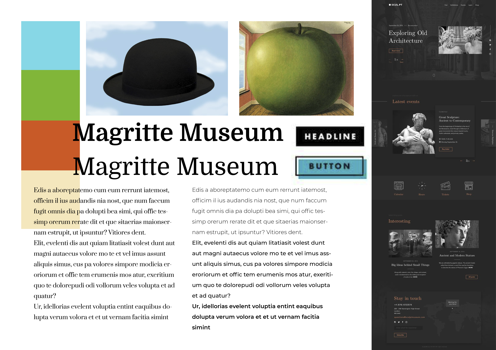
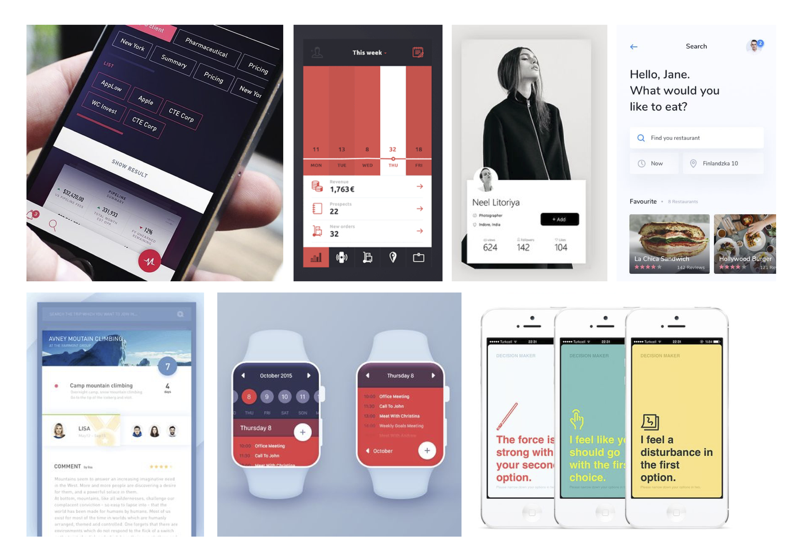
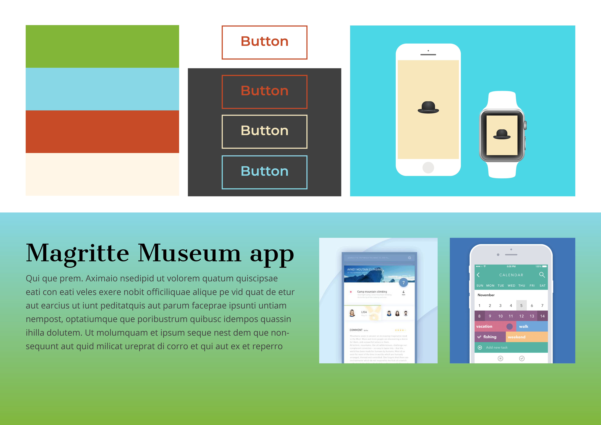

{:.img-fluid}  

We hebben de kleuren van zijn bekendste schilderijen gepakt en willen daarmee onze app maken. Dit geeft een goed beeld van Magritte weer. 
De afbeelding met de donkere achtergrond wijst terug naar de donkere kamers waar de schilderijen hingen.
Voor de titels hebben we een serif font bedacht was klassiek uitstraalt, omdat Magritte ook redelijk oud is. Om dit te compenseren houden we voor de platte tekst een non-serif font aan.
{:.alert.alert-secondary}

{:.img-fluid}  

Dit zijn wat ideeën voor de timetable voor de film. In het museum zelf was er geen sprake van een timetable en wist je ook niet wanneer de film begon. We willen dit zeker in onze app steken omdat dit handig is voor iedereen.
Ook willen we quotes van Magritte verwerken in de app, omdat dit in het museum ook veel gebruikt werd.
{:.alert.alert-secondary}

{:.img-fluid}  

Ook lijkt het ons leuk om een verloop van de twee “hoofdkleuren” te maken, want dit geeft niet en iets modernere vibe aan onze app.
We hebben al geprobeerd om de kleuren wat samen te stellen en dit geeft een goed beeld van de stijl van Magritte weer.
{:.alert.alert-secondary}