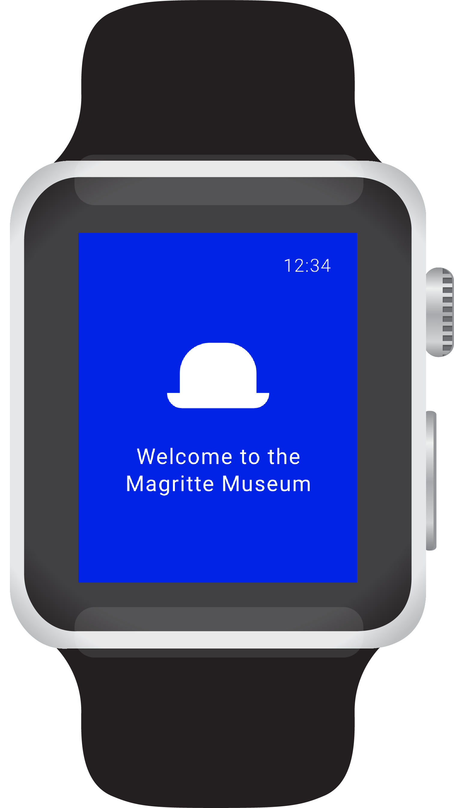

    

        

            
De smartwatch app is een ondersteuning voor onze app voor de iPhone. Je kunt onder andere zien wat jouw hartslag is gedurende het bezoek en hoeveel stappen je destijds heeft gelopen. Indien je het spel speelt kun je zien hoeveel punten jij ondertussen heeft. 
            

Voor de film kun je een kleine timetable zien met de uren wanneer de film begint. Je kunt een van de uren kiezen en krijg je 5 minuten ervoor een melding dat de film bijna begint. 
            Daarnaast krijg je tussendoor onder andere meldingen als je een schilderij hebt gemist op basis van jouw opgeslagen schilderijen dat je op de app hebt aangegeven. 
            

        

    

    

        
    

